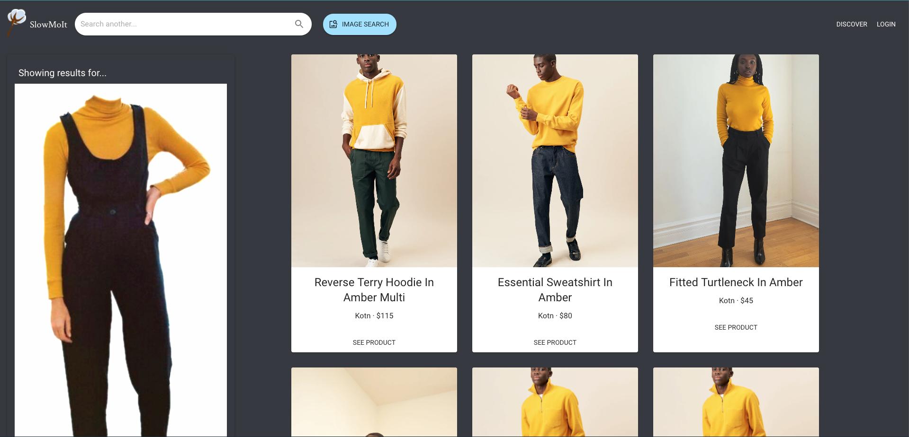

# SlowMoIt - DubHacks 2020

## Inspiration
Our project aims to answer the question, _How can e-commerce and consumption be ethical and sustainable while remaining efficient?_
Specifically, SlowMoIt tackles the issue of fast fashion by increasing accessibility to sustainable brands.

**What is fast fashion?**
Fast fashion has accelerated the traditional business model in the fashion industry, encouraging people to buy more clothes by offering low prices and increasing the number of new seasons per year. However, the growing demand fuelled by fast fashion takes a toll on the environment.
[https://unearthed.greenpeace.org/2019/09/12/fast-facts-about-fast-fashion/]((Source))

We are often surrounded by fast fashion brands, and so we tend to buy from them without much thought. SlowMoIt promotes
slow fashion alternatives. If we find a piece of clothing we like, we can use SlowMoIt to explore purchasing options from
sustainable brands.

## What it does
Users upload an image of a clothing piece. SlowMoIt analyze the image and recommends similar items from sustainable brands such as Tentree, Kotn, and Reformation.

## How we built it
**Frontend:** We built the interface using React, Typescript, and Material UI components.

**Backend**: We stored reference images for sustainable products in GCP Storage. We then created a Product Set using GCP Vision to index the images and provide recommendations. This functionality is wrapped in a flask app to provide abstraction. Users request with an image Uri and the response is a list of products with name, price, image, link, and labels.

## Challenges
Matching appropriate recommendations to the selected image was a challenge because we did not always get relevant results.

## Accomplishments we're proud of
We are proud to have made a working app! And learning React!

## What's next for SlowMoIt
We will look into more comprehensive product ranking approaches to provide better results and better filtering.

We will expand by creating an Explore page where users can view popular items, and implement login functionality where users can save their favourite items.
